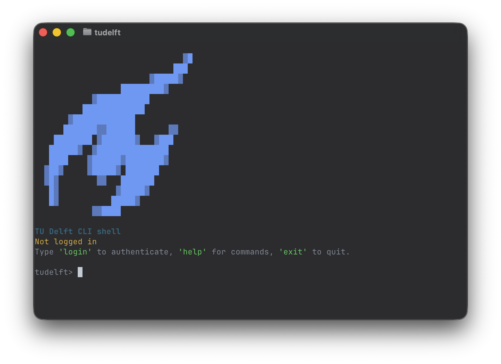

# TU Delft CLI

An unofficial command-line interface for TU Delft student portal workflows.

TU Delft CLI connects to `my.tudelft.nl` and allows students to access common academic information directly from the terminal, including grades, EC progress, enrollments, course suggestions, exam suggestions, Study Guide links, and enrollment workflows.

---

## Features

Current functionality includes:

- View grades
- View EC progress
- View student profile
- View current course enrollments
- View current exam enrollments
- Suggest currently available courses from your fixed programme
- Suggest courses with open exam opportunities
- Enroll in courses directly from the terminal
- Enroll in exam opportunities directly from the terminal
- Open TU Delft Study Guide course links
- Interactive shell mode

---

## Installation

### Recommended: install with pipx

Install using `pipx` so the CLI is available globally without affecting your Python environment.

    pipx install git+https://github.com/jenslawrence/tudelft-cli.git

### Install browser dependency for login

This project uses Playwright for browser-based TU Delft authentication.

After installation, install Chromium once:

    playwright install chromium

---

## First Use

Start the shell:

    tudelft

Or use one-shot commands:

    tudelft grades
    tudelft grades --output json
    tudelft ec
    tudelft whoami

Log in:

    tudelft login

A browser window opens for TU Delft authentication.

After successful login, your session is stored locally.

---

## Example Commands

Authentication and profile:

    tudelft login
    tudelft status
    tudelft whoami
    tudelft whoami --output json
    tudelft whoami --output pretty
    tudelft logout

Grades and progress:

    tudelft grades
    tudelft grades --output json
    tudelft grades --final-only
    tudelft grades --final-only --output json

    tudelft ec
    tudelft ec --output json

Enrollments and suggestions:

    tudelft enrollments
    tudelft enrollments --output json
    tudelft enrollments --courses
    tudelft enrollments --courses --output json
    tudelft enrollments --exams
    tudelft enrollments --exams --output json

    tudelft suggest-courses
    tudelft suggest-courses --output json
    tudelft suggest-exams
    tudelft suggest-exams --output json

Course and exam enrollment:

    tudelft enroll-course CSE2530
    tudelft enroll-course CSE2530 CSE1500 --yes
    tudelft enroll-exam CSE2530
    tudelft enroll-exam CSE2530 --select 1
    tudelft enroll-exam CSE2530 --select 1 --yes

Course information:

    tudelft course CSE2530
    tudelft course CSE2530 --output json
    tudelft course CSE2530 --open

Enrollment commands show a confirmation prompt before making changes. Pass `--yes` to skip that prompt. `enroll-exam` opens an interactive selector when multiple exam opportunities are available unless `--select` is provided.

JSON output is selected with `--output json` or `-o json`.

---

## Current Command Surface

Implemented commands:

- `tudelft login`
- `tudelft logout`
- `tudelft status`
- `tudelft whoami`
- `tudelft grades`
- `tudelft ec`
- `tudelft enrollments`
- `tudelft suggest-courses`
- `tudelft suggest-exams`
- `tudelft enroll-course COURSE_CODES...`
- `tudelft enroll-exam COURSE_CODE`
- `tudelft course COURSE_CODE`

---

## Interactive Shell

Running:

    tudelft

opens the interactive shell.

Inside the shell, run commands without the `tudelft` prefix:

    grades
    grades --output json
    ec
    enrollments --courses
    suggest-courses
    enroll-course CSE2530

Shell shortcuts:

    help / h / ?
    reset / clear / cls
    exit / quit / q

The shell uses pretty output for `whoami`, `ec`, and `grades` by default unless you pass `--output` or `-o`.

---

## Authentication

Authentication is performed through TU Delft Single Sign-On.

The CLI does **not** ask for your password in the terminal.

Instead:

- a browser window opens
- you authenticate through TU Delft SSO
- the CLI captures the resulting bearer token
- the token is stored locally for future requests

Session files are stored in:

    ~/.config/tudelft-cli/

---

## Development Setup

Clone the repository:

    git clone https://github.com/jenslawrence/tudelft-cli.git
    cd tudelft-cli

Create virtual environment:

    python3 -m venv .venv
    source .venv/bin/activate

Install editable package:

    pip install -e .

Install browser dependency:

    playwright install chromium

Run:

    tudelft

---

## Disclaimer

This project is unofficial and not affiliated with TU Delft.

Use at your own responsibility when performing enrollment actions.

TU Delft portal APIs may change without notice.

---

## Roadmap

Planned features:

- Smarter enrollment recommendations
- Auto-update checks
- PyPI release
- Cross-platform packaging

---

## License

MIT License
